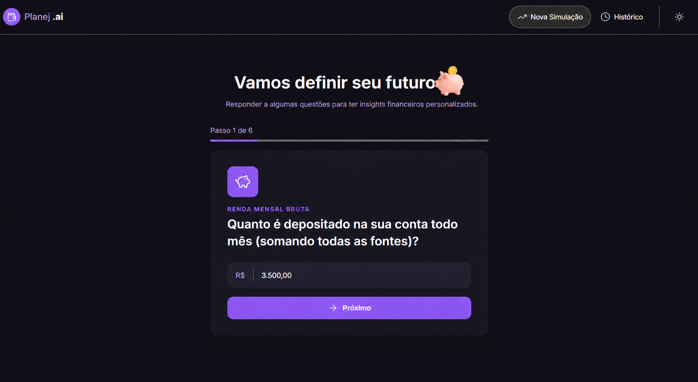
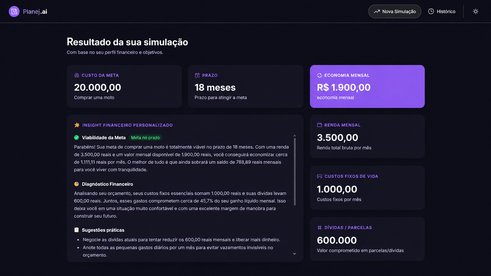
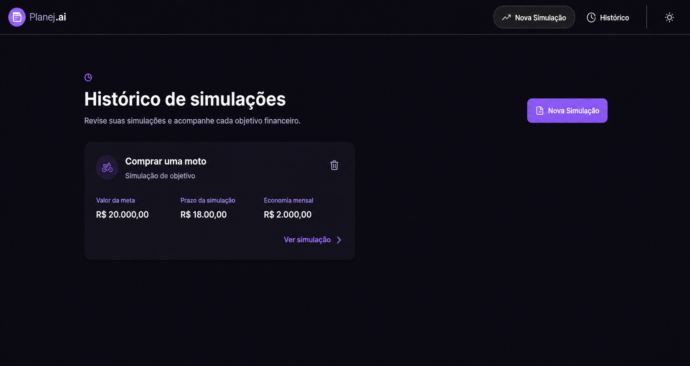

# Planej.ai – Educador Financeiro Inteligente

Aplicação web desenvolvida com **React**, **TypeScript**, **Vite** e **Google Gemini IA** para ajudar usuários a fazer um planejamento financeiro de forma simples e personalizada.

## Sobre o projeto

O Planej.ai permite que o usuário informe sua renda, gastos e objetivo financeiro. Com essas informações, a inteligência artificial gera um diagnóstico personalizado com sugestões práticas para melhorar o planejamento financeiro.

## Funcionalidades

- Preenchimento de dados financeiros.
- Geração de insights com IA (Google Gemini).
- Interface moderna com React e Tailwind CSS.
- Tema claro e escuro.
- Histórico de simulações salvo no navegador (localStorage).

## Tecnologias utilizadas

- React
- TypeScript
- Vite
- Tailwind CSS
- Google Gemini API
- LocalStorage

## Configurar a IA

1. Crie uma chave no [Google AI Studio](https://aistudio.google.com/apikey).
2. Crie um arquivo `.env` na raiz do projeto, baseado em `.env.example`:

```env
VITE_GEMINI_API_KEY=sua_chave_real_aqui
```

3. Reinicie o servidor com `pnpm dev` depois de alterar o `.env`.

O arquivo `.env` não deve ser enviado ao GitHub.

## Como executar o projeto

1. Clone o repositório:

```bash
git clone https://github.com/felipetrabalhod-droid/Planejai-projeto.git
```

2. Entre na pasta do projeto:

```bash
cd Planejai-projeto
```

3. Instale as dependências:

```bash
npm install
```

4. Inicie a aplicação:

```bash
npm run dev
```

## Como testar

1. Abra a aplicação no navegador.
2. Preencha sua renda, gastos e objetivo financeiro.
3. Clique em gerar análise.
4. Leia as recomendações geradas pela IA.
5. Acesse a página **Histórico** para visualizar as simulações salvas.

## Melhoria implementada

Como evolução do projeto base, foi adicionada uma **página de Histórico de Simulações**, onde todas as análises geradas são armazenadas automaticamente utilizando **localStorage**, permitindo consultar resultados anteriores mesmo após atualizar a página.

## Capturas de tela

### Tela inicial



### Resultado da IA



### Histórico de simulações



## Aprendizados

Durante este desafio pratiquei:

- Desenvolvimento com React e TypeScript.
- Organização de componentes.
- Gerenciamento de estado.
- Integração com IA Generativa.
- Persistência de dados com localStorage.
- Estruturação de um projeto para portfólio.
